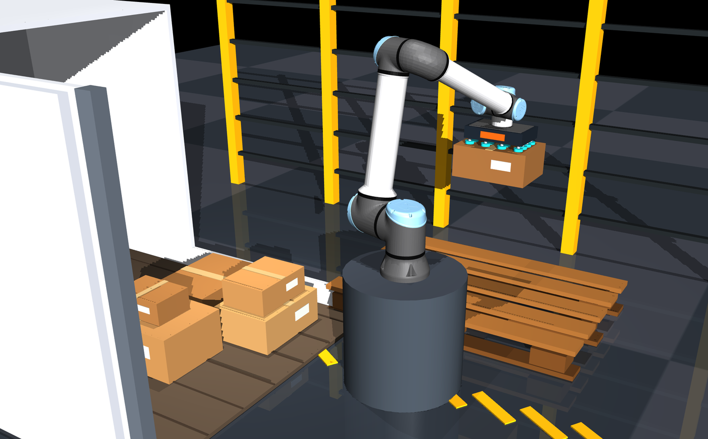
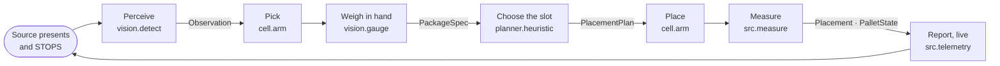
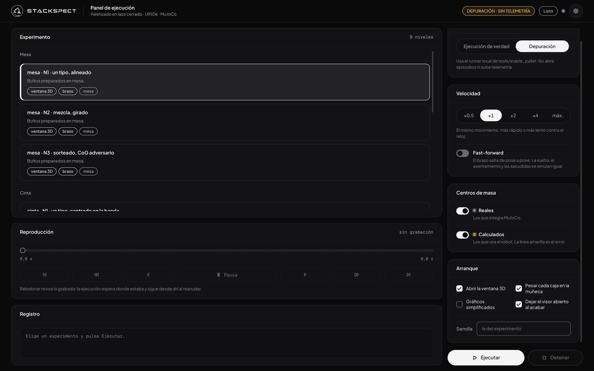
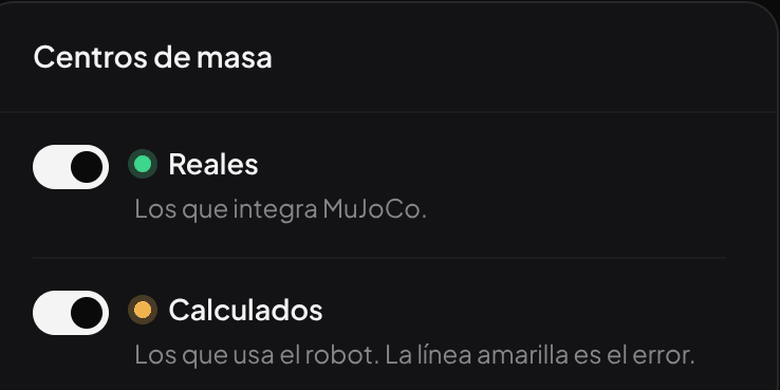
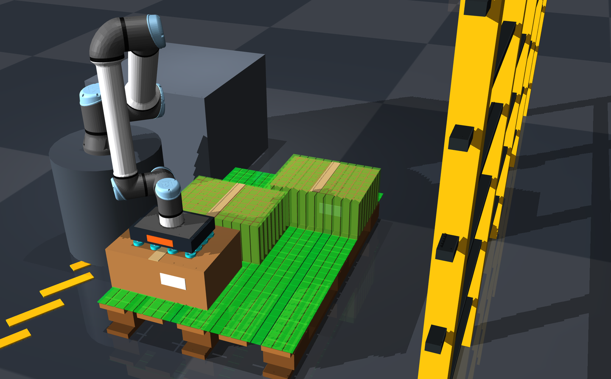
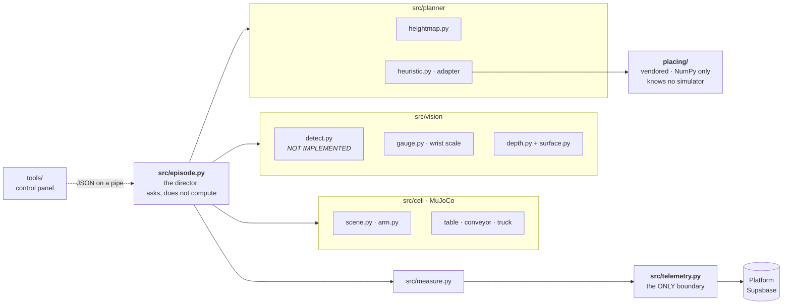

# Simulation

[](LICENSE)
[](#requirements)
[](#requirements)
[](#the-cell)
[](#development)

**Closed-loop palletizing in MuJoCo.** A UR10e with a suction gripper takes packages off a
table, a conveyor or a truck trailer, weighs each one in the air, decides where it goes and
stacks it. Nothing is scripted — the arm does not know what the next package is until it is
holding it. Every run streams live to the
[Platform](https://github.com/STACKSPECT/Platform) observability project.

<div align="center">
  
</div>

```console
$ python scripts/palletize.py -n 1 --no-telemetry --level 11
modo: oráculo · ScorePlanner · mapa oráculo · mesa · N1 · un tipo, alineado
  std_m-00  L1  error 2.7 mm  apoyo 100%  margen +124.9 mm  ok
  std_m-03  L2  error 2.6 mm  apoyo  88%  margen +253.7 mm  ok
semilla 1: 4/4 · ÉXITO
```

[The loop](#the-loop) · [Requirements](#requirements) · [Control panel](#the-control-panel) ·
[Placement](#how-a-slot-gets-chosen) · [The cell](#the-cell) · [Usage](#usage) ·
[Status](#status) · [Development](#development)

---

## The loop

One package, start to finish — also the order the modules are called in. The objects on the
arrows are the entire shared vocabulary, defined once in `src/contracts.py`.



**Measurement happens after picking and before planning.** That is what forces the planner
to be incremental: it cannot precompute the pallet, because it does not know the next
package until the arm is holding it.

## Requirements

| Need | Version | Why |
|---|---|---|
| **Python** | 3.11+ | verified here on 3.12.3 |
| **Linux or macOS** | — | `scripts/setup.sh` is bash; wants `python3` and `git` |
| **OpenGL context** | — | rendering. No GPU needed — headless runs use EGL automatically |
| **[`STACKSPECT/Platform`](https://github.com/STACKSPECT/Platform)** | branch **`dev`** | **hard requirement**, see below |
| **[`uv`](https://docs.astral.sh/uv/)** | — | only for `tools/` — the demonstrator and the control panel |

### Dependencies

Pinned to `==` in [`requirements.txt`](requirements.txt); every licence below was read from
the installed package metadata.

| Package | Version | Licence | Used for |
|---|---|---|---|
| `mujoco` | 3.13.0 | Apache-2.0 | Physics, rendering, the viewer |
| `numpy` | 2.4.4 | BSD-3-Clause | Everywhere. The only thing `placing/` imports |
| `PyYAML` | 6.0.3 | MIT | `configs/` |
| `imageio` | 2.37.3 | BSD-2-Clause | The pallet PNGs and the timelapse |
| `theker_telemetry` | editable | see Platform | The platform contract. **Not** in `requirements.txt`, on purpose |

The control panel is packaged separately in [`tools/pyproject.toml`](tools/pyproject.toml)
with its own `uv.lock` — `mujoco`, `numpy`, `PyYAML`, plus `pytest`, `ruff` and
`imageio-ffmpeg` behind extras; someone who only runs episodes installs none of it. Model
attribution (UR10e kinematics and meshes from
[MuJoCo Menagerie](https://github.com/google-deepmind/mujoco_menagerie), BSD-3-Clause) is in
**[`THIRD_PARTY_NOTICES.md`](THIRD_PARTY_NOTICES.md)** — the meshes download at install time
and are never committed.

> [!WARNING]
> **`requirements.txt` has drifted.** `mink`, `qpsolvers`, `daqp` and `scipy` are still
> pinned, but nothing in `src/`, `placing/`, `scripts/` or `tests/` imports any of them —
> the IK is now the damped least-squares solver in `src/cell/arm.py`. Worth cleaning up:
> `qpsolvers` is LGPL-3.0, the only non-permissive entry.

<details>
<summary><b>Installation, and why Platform has to be the <code>dev</code> branch</b></summary>

```bash
git clone https://github.com/STACKSPECT/Simulation
git clone -b dev https://github.com/STACKSPECT/Platform      # the required sibling

cd Simulation && bash scripts/setup.sh && source .venv/bin/activate
```

`scripts/setup.sh` creates `.venv`, installs `requirements.txt`, installs the SDK editable
from `$PLATFORM/backend` (default `../Platform`), asserts it is `dev`, and clones
`mujoco_menagerie` into `third_party/` (git-ignored, never vendored). On success it prints
`SDK ok: ciclo de vida y geometría disponibles`. Point it elsewhere with
`PLATFORM=/path/to/Platform`.

The `theker_telemetry` SDK is deliberately not vendored here: it is the contract of what the
platform stores, and whoever stores the data defines its shape. Platform's `main` ships only
`core.py` and `schema.py` — `pallet.py`, the source of `stability_margin` and
`support_polygon`, is on `dev`, and so is the live episode lifecycle (`RunLog.begin` /
`end` / `snapshot`). **That failure does not appear at install time, it appears at run
time**, which is why `setup.sh` asserts on it and stops.

For credentials, copy `.env.example` to `.env` here or in the parent directory.
`SUPABASE_SERVICE_KEY` bypasses RLS and is the only one that writes — Python side only.
**With a `.env` present, telemetry is on by default**, and every run prints which mode it is
in. The SDK treats "no credentials" as normal and writes to disk silently, so that printed
line is the only thing between you and a run you thought was uploading.

</details>

## The control panel

`tools/` ships a browser panel for driving experiments — stdlib only, no framework, no
bundler, nothing fetched at start-up. It talks to the cell over JSON on a pipe; nothing in
`webapp.py` touches MuJoCo.

```bash
cd tools && uv sync --extra dev --extra video
uv run stable-pallet dashboard          # prints: Panel en http://127.0.0.1:8000/
```

<div align="center">
  
</div>

| Control | What it does |
|---|---|
| **Experiment picker** | The nine levels, read straight from `configs/pallet.yaml`. Add a level to the YAML and the card appears |
| **Mode** | *Ejecución* runs `scripts/palletize.py` and publishes if credentials exist. *Depuración* runs the local runner, never opens an episode, never uploads — the header reads `DEPURACIÓN · SIN TELEMETRÍA` so the two cannot be confused |
| **Speed** | ×0,5 to *máx*, changeable mid-run: the same trajectories, paced differently |
| **Fast-forward** | Skips the trajectories — the arm jumps waypoint to waypoint — while still simulating what decides the outcome: the release, the settle, the jolts |
| **Playback** | Pause, scrub, step either way, play backwards. The run waits where it was and continues from there |
| **Start-up** | 3D window, weigh each box, simplified graphics, hold the viewer open, seed override |

<div align="center">
  
</div>

That toggle is the project in miniature: **reales** are what MuJoCo integrates,
**calculados** what the robot derived from the wrist, and the yellow line between them is the
error — a bad weighing made visible before it becomes a collapse.

The panel is not the entry point and cannot become one: only `scripts/palletize.py` chooses
real components against oracle stubs, so only it can compute a run's `oracle` flag.

## How a slot gets chosen

The height map is **measured, never tracked in a counter.** Three depth cameras — overhead
plus two opposed diagonals — render depth; the points are unprojected into the world,
everything not facing upwards is discarded, and the rest is rasterised onto the pallet
footprint and fused by keeping the highest value per cell. A cell no camera saw is marked
unobserved: zero height is not the same as free deck.

With that map and the package in hand, `placing/` enumerates every discrete pose that fits,
hard-filters the infeasible ones, and scores the rest over **fourteen terms**:

```
support_ratio  com_margin  lowness    void_fill   levelness  peak_penalty  lateral_proximity
edge_flush     seam_break  overhang   pallet_com  reachability  bridge      gap_waste
```

The score is a number in `[0, 1]` and the chosen slot is the maximum. The breakdown rides
with the `plan` event, so *"why did it put that box there?"* is answerable without re-running
the episode. **To change the behaviour you change the weights** in
`configs/pallet.yaml: heuristic.weights` — a weight of 0 switches its term off — not the code.

<div align="center">
  
</div>

`placing/` is vendored and **must not be edited.** Its boundary is an executable assert, not
a convention: `python -m placing` runs fifteen checks and the first asserts that no heavy
module leaked into `sys.modules` — which is what lets the weights be tuned in milliseconds
instead of minutes of physics.

Two alternatives exist purely to be measured against it: `--naive-planner` (a grid baseline,
which counts as an oracle) and `--beam-planner` (the beam search from `tools/`, which does
not — 100 % strictly-stable stacks against first-fit's 50 %, mean CoM off-centring
142 mm → 81 mm). When nothing scores at all, that is not an exception: it is a
`wrong_placement`, with the reason in the `fail` event.

## The cell

Each folder is a boundary — you work inside one without opening the others.



**UR10e on a pedestal, OnRobot VGP20 with 16 Ø40 mm cups.** 1300 mm reach, 12.5 kg payload;
the tool weighs 2.55 kg, so the package ceiling is 8.5 kg. The pallet is a real europallet,
1.20 × 0.80 m, at scale 1. Every calibrated number sits beside its measurement in
[`configs/scene.yaml`](configs/scene.yaml) and [`configs/pallet.yaml`](configs/pallet.yaml)
— if you change one, write down how you measured it.

Three sources, one contract (`Supply.present()` / `release()`), three levels each:

| | N1 | N2 | N3 |
|---|---|---|---|
| **Table** — staged, nothing moves | `11` one type, aligned | `12` mixed, rotated | `13` random, adversarial CoG |
| **Conveyor** — stops on *measured* rest | `21` one type, centred | `22` mixed, off-centre | `23` random, variable spacing |
| **Truck** — whole load, highest box only | `31` ordered columns | `32` the loader's disorder | `33` random, adversarial CoG |

Each type carries a `cog_offset_m`: the centre of mass is *not* the geometric centre.
`vision/gauge.py` estimates it from one plumb wrist reading — the horizontal components come
out exact, the vertical is anchored to the geometric centre because nothing downstream reads
it — and `--precise-com` sweeps several poses when that is not enough. The method and its
five preconditions are in **[`pesaje-en-el-sitio.md`](pesaje-en-el-sitio.md)**.

## Usage

`scripts/palletize.py` is the entry point.

| Flag | Effect |
|---|---|
| `-n N`, `--seed N` | Episode count and starting seed |
| `--source table\|conveyor\|truck` | First level of that source |
| `--level N` | One specific level from the table above |
| `--viewer` | Open the 3D window (one episode only) |
| `--speed F` | Wall-clock pacing; `0` = as fast as the machine manages |
| `--no-telemetry` | Disk only. **Otherwise it uploads by default** |
| `--no-oracle-gauge` | Weigh on the wrist for real |
| `--no-oracle-heightmap` | Build the map from the three cameras |
| `--beam-planner` / `--naive-planner` | The beam search, or the grid baseline |
| `--precise-com` | Sweep several wrist poses instead of one plumb reading |
| `--video`, `--show-com`, `--simplified-graphics` | Timelapse, final CoG in the report, cheap visuals |
| `--protocol json` | Line protocol — how the panel drives it |

The startup line always names the planner and where the height map came from: two runs being
compared have to be told apart by reading the output, not by remembering which flags were
typed.

**Disk is the source of truth and Supabase is a replica.** Each run writes
`runs/<timestamp>-pallet/episodes.jsonl` — one line per episode with its metrics and the
planner's full score breakdown — plus top and side PNGs per layer under `<seed>/`. A network
failure warns once, switches uploading off, and lets the episode finish.

## Status

The loop runs end to end on all three sources today. What does not:

| Piece | State | Detail |
|---|---|---|
| Cell, arm, vacuum, three sources | ✅ | `tests/test_cell.py`, 9 physical checks |
| Wrist gauge | ✅ | Mass and planar CoM recovered |
| Scoring heuristic | ✅ | The default planner. 15 checks, no simulator |
| Measurement + live telemetry | ✅ | Rows verified against the schema |
| Control panel | ✅ | Both modes, nine levels |
| Height map from cameras | 🟡 | Runs, not at parity: level 11 seed 1 places 3/4 against the oracle's 4/4, ending in `wrong_placement`. Hence `allow_unobserved: true` — coverage over an empty pallet measures 93.3 %, not the 98 % that would justify `false` |
| **Perception** (`vision/detect.py`) | ❌ | The **only** `NotImplementedError` in the repo |
| Reachability filter | ❌ | Off — the reach figures in `placing/` are a Panda's, so the planner can pick a slot the arm cannot reach (`ik_unreachable`) |

> [!IMPORTANT]
> **Every run is still flagged `oracle = true`.** The flag is `any(stub in use)`, and with
> `CameraDetector.observe()` unimplemented no combination of flags clears it —
> `--no-oracle-vision` raises `NotImplementedError: percepción sin implementar`. The gauge,
> the height map and the planner can each be switched to the real thing, but the flag stays
> `true` until perception lands.

## Development

Read **[`AGENTS.md`](AGENTS.md)** in full before writing any code — it is in Spanish, it is
where the project's real knowledge lives, and every hard rule in it cost a lost run in the
predecessor repository. [`CONTRIBUTING.md`](CONTRIBUTING.md) covers branches, commits and
the language rule (code and comments Spanish, outward-facing docs English). Work lands on
`dev`: branch from it, target it.

<details>
<summary><b>The verification ladder — all six rungs pass on this branch</b></summary>

Cheapest first on purpose. Run it in this order and stop at the first failure; the results
are what they printed here.

| | Command | Proves | Result |
|---|---|---|---|
| 0 | `python -m placing` | The heuristic alone; first check is the import boundary | `15 checks passed` |
| 1 | `python tests/test_pallet.py` | Row keys are columns, `seq` never repeats, vocabularies hold, the adapter's silent unit translations | `20 comprobaciones pasadas` |
| 2 | `python -m src.measure` | CoG with out-of-tolerance boxes, margin against the support polygon | `ok measure.demo` |
| 3 | `python tests/test_cell.py` | Starts MuJoCo: three sources, cameras, belt, truck order, IK envelope, wrist gauge | `9 comprobaciones físicas pasadas` |
| 4 | `python scripts/palletize.py -n 1 --no-telemetry --level 21` | A whole episode to disk | `4/4 · ÉXITO` |
| 5 | `cd tools && uv run pytest` | The demonstrator survived being moved | `179 passed` in 67 s |

Then with telemetry on: the run must print that it is active, the episode must appear *in
progress* in the UI within seconds, and the pallet must build package by package. The SQL
checks are in `AGENTS.md` §9.

`tests/test_pallet.py`, `tests/test_cell.py`, `python -m placing` and `python -m src.measure`
are plain asserts run as scripts. Do not add pytest, a `conftest.py` or fixtures to them —
the point is that they run in seconds with nothing installed beyond the dependencies, and
that anyone can read the file top to bottom. `tools/` is the exception: separately packaged,
and it does use pytest.

</details>

<details>
<summary><b>The three closed vocabularies — the easiest thing to break</b></summary>

Closed CHECKs in the database. Inventing a value does not raise an error where you write it:
it fails later, silently, and usually takes the rest of the run's uploads with it. All three
are anchored by `tests/test_pallet.py`.

| Vocabulary | Allowed values | What an invented value does |
|---|---|---|
| `events.kind` | `perceive` `plan` `pick` `place` `settle` `fail` | Rejected with a 400 the SDK swallows, and uploads stay off for the rest of the run. There is deliberately **no kind for any source** — their state rides in the `perceive` payload |
| `snapshots.view` | `top` `side` `iso` `camera` | The PNG uploads to Storage and *then* the row is rejected with a `23514`: an orphaned photo and a trace with no image |
| `failure` | `no_detection` `ik_unreachable` `collision` `grasp_slip` `wrong_placement` `timeout` `stack_collapse` `overhang_violation` | `EpisodeResult` raises `ValueError`, on purpose. Adding one means touching three places in Platform — ask the backend owner |

The asymmetry worth memorising: **inside an event `payload` extra keys are harmless and
missing keys break silently; at the row level extra keys are lethal**, because
`event` / `placement` / `pallet_state` / `snapshot` take `**kwargs` and every key is a
column. Columns are SI; payloads are mm and degrees, converted at the telemetry boundary and
nowhere else. `task` is the level's **source** — `table`, `conveyor` or `truck` — taken from
`scene.level.source`, never hard-coded; the UI shows it translated (mesa, cinta, camión).

Rows are written **live** — `begin()` opens the episode, the row functions drop rows as
things are measured, `end()` closes it with a PATCH — which is the only reason the Live
screen is live. An open episode is closed **always**, including on Ctrl-C: one orphan left in
`running` pins that screen indefinitely.

</details>

<details>
<summary><b>Boundaries that are not negotiable</b></summary>

- **Platform knowledge lives only in `src/telemetry.py`.** What crosses module boundaries are
  `contracts.py` objects, never rows.
- **Do not reimplement `stability_margin` or `support_polygon`.** They come from the SDK; a
  third copy would drift from the one the UI draws.
- **Do not let a module read the scene on its own.** If `heuristic.py` imports `mujoco`,
  something went wrong. The oracle stubs are the deliberate exception, which is why they live
  in separate, clearly named files.
- **Do not put anything inside `placing/`**, not even a convenience import.
- **Do not eyeball `configs/`.** Every odd value has its measurement beside it.

</details>

<details>
<summary><b>How it differs from its predecessor</b></summary>

[`Guionized-simulation`](https://github.com/STACKSPECT/Guionized-simulation) did the same job
with every box's slot written out in YAML. It existed to pin down the platform contract
before the real system existed. **This repository is the real system.**

| | scripted | here |
|---|---|---|
| where each box goes | written in `configs/pallet.yaml` | scored and chosen from what is measured |
| what the source delivers | nothing — boxes wait pre-placed | a table, a physical conveyor, or a loaded trailer |
| dimensions and mass | read from the catalogue | measured with the package in hand |
| pallet surface | assumed | fused from three depth cameras |
| `no_detection` | unreachable | reachable, once perception exists |

</details>

## Licence

[MIT](LICENSE) © 2026 STACKSPECT. The dependency audit above found no licence incompatible
with releasing under MIT.
